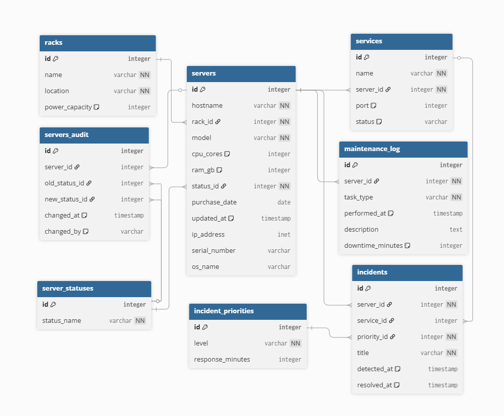

# Расчетно-графическая работа
## Проектирование и реализация БД
### Выполнили студенты ИКС-433 группы Демин С. А. и Петров Р. Ю.
### Цель работы: 
1. Спроектировать авторскую реляционную базу данных по тематике, связанной с **телекоммуникационными технологиями (в особенности, мобильная, спутниковая связь)** или **IT-индустрией**.

3. Реализовать спроектированную схему в СУБД PostgreSQL с использованием структурированного SQL-скрипта.

3. Визуализировать логическую структуру БД в виде диаграммы (ER-модели).

4. Разработать комплексный набор SQL-запросов, демонстрирующих функциональные возможности и аналитический потенциал созданной системы.

### Краткое описание проекта:
#### Тема проекта
Управление оборудованием в дата-центре (стойки, серверы, сервисы, инциденты).

#### Назначение
Разрабатываемая реляционная база данных предназначена для централизованного учёта и мониторинга IT-инфраструктуры дата-центра. Система позволяет отслеживать размещение оборудования, управлять жизненным циклом серверов, контролировать работоспособность сервисов, фиксировать инциденты и вести журнал технического обслуживания.

#### Основные сущности и их роль

|Сущность| Назначение|
|:---|:---|
|**racks** (стойки)|Хранение информации о физическом размещении оборудования|
|**server_statuses** (справочник статусов)|Справочник возможных состояний сервера|
|**servers** (серверы)|Учёт серверного оборудования: hostname, модель, ресурсы (CPU, RAM), IP-адрес, серийный номер, ОС, привязка к стойке и статусу|
|**services** (сервисы)|Фиксация программных сервисов, запущенных на серверах|
|**incident_priorities** (приоритеты инцидентов)|Справочник уровней приоритета с указанием нормативного времени реакции|
|**incidents** (инциденты)| Журнал сбоев и проблем: привязка к серверу и/или сервису, приоритет, время обнаружения и устранения|
|**maintenance_log** (журнал обслуживания)| Регистрация плановых и внеплановых работ|
|**servers_audit** (аудит статусов)|Автоматическая запись истории изменения статуса серверов с указанием времени и инициатора|

#### Ключевые возможности

- Контроль размещения серверов по стойкам с учётом энергомощности.
- Отслеживание текущего состояния каждого сервера.
- Учёт запущенных сервисов и их статусов.
- Фиксация инцидентов с привязкой к оборудованию и приоритетам.
- Хранение истории обслуживания и времени простоев.
- Аудит изменений статусов серверов.
- Каскадное удаление сервисов при удалении сервера.
- Защита целостности данных через внешние ключи и ограничения.

#### Индексы
| № | Таблица | Индекс | Колонка | Назначение |
|---|---------|--------|---------|-------------|
| 1 | servers | idx_servers_rack_id | rack_id | Фильтр по стойке |
| 2 | servers | idx_servers_status_id | status_id | Фильтр по статусу |
| 3 | servers | idx_servers_hostname | hostname | Поиск по имени |
| 4 | servers | idx_servers_ip_address | ip_address | Поиск по IP |
| 5 | services | idx_services_server_id | server_id | Фильтр по серверу |
| 6 | services | idx_services_status | status | Фильтр по статусу |
| 7 | incidents | idx_incidents_detected_at | detected_at | Поиск по дате |
| 8 | incidents | idx_incidents_priority_id | priority_id | Фильтр по приоритету |
| 9 | incidents | idx_incidents_server_id | server_id | Фильтр по серверу |
| 10 | maintenance_log | idx_maintenance_log_performed_at | performed_at | Поиск по дате |
| 11 | maintenance_log | idx_maintenance_log_server_id | server_id | Фильтр по серверу |
| 12 | servers_audit | idx_servers_audit_changed_at | changed_at | Поиск по дате |
| 13 | servers_audit | idx_servers_audit_server_id | server_id | Фильтр по серверу |

### Графическая модель данных:

